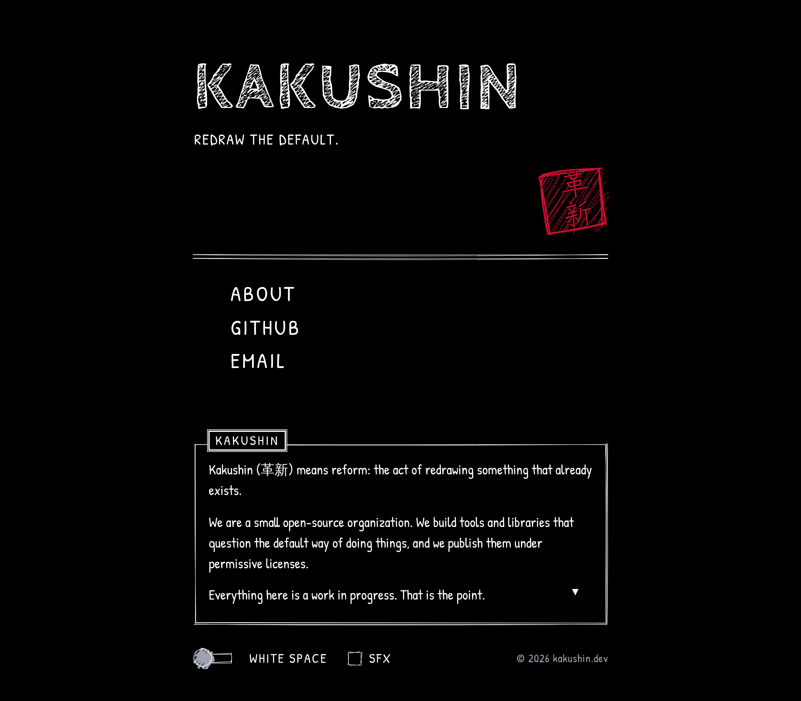

# kakushin.dev

Landing page for **Kakushin (革新)**, a small open-source project organization.

**Live: https://kakushin.dev**



Kakushin means reform, the act of redrawing something that already exists. The page
is built to look the part: everything you see is drawn at runtime with rough, wobbling
strokes rather than shipped as images.

Hand-drawn look built with [wired-elements](https://wiredjs.com) and [Rough.js](https://roughjs.com),
in the spirit of a certain black-and-white RPG title screen. No framework and no runtime
CDN. Fonts and libraries are bundled by Vite, so the page loads entirely from its own origin.

## What is in here

| Path | What it holds |
| --- | --- |
| `src/content.js` | Every word on the page. Start here. |
| `index.html` | Static skeleton with `{{placeholders}}` and the meta tags. |
| `src/style.css` | Palette, layout, the RPG dialogue box, keyframes. |
| `src/sketch.js` | The 革新 seal and the pointing hand, drawn with Rough.js. |
| `src/main.js` | Behaviour: typewriter, menu, theme toggle, opt-in sound. |
| `vite.config.js` | A small plugin that fills the placeholders and emits robots, sitemap and manifest. |
| `scripts/og.mjs` | Renders the social preview image and icons into `public/`. |

## Develop

```bash
npm install
npm run dev       # http://localhost:5173
npm run build     # -> dist/
npm run preview   # serve dist/ locally
```

Requires Node 22.12 or newer.

## Edit the words

Everything the page says is in [`src/content.js`](src/content.js): name, tagline, about text,
menu links and their hover hints. `{{placeholders}}` in `index.html` are filled from that file at
build time by the small plugin in `vite.config.js`, so the shipped HTML is fully static and still
readable by crawlers with JavaScript disabled.

## Details worth knowing

- **WHITE SPACE / BLACK SPACE** toggle in the footer inverts the page and is remembered per browser.
- **SFX** is off by default. When on, menu blips are synthesized with Web Audio. No audio files ship.
- Every animation is disabled under `prefers-reduced-motion`.
- Arrow keys walk the menu and Enter follows the link. The menu items are real anchors.
- Hovering a sketched element re-rolls its seed, so the ink is redrawn slightly differently.
- Fonts are self-hosted via Fontsource: Cabin Sketch, Patrick Hand, Zen Kurenaido, all under the
  SIL Open Font License. Only the two Zen Kurenaido subset slices holding 革 and 新 are shipped.

## Why these versions

- `wired-elements` 3.0.0-rc.6 is the newest release on npm. It calls a Rough.js filler API that was
  renamed in Rough.js 4.5, so `roughjs` is pinned to 4.3.1 (one copy, shared with our own drawings).
- `roughjs` is imported from `roughjs/bundled/rough.esm.js` because the package's browser entry is a
  UMD build without an ES default export.
- Do not add `lit` directly. wired-elements brings its own Lit 2 and a second copy would break dedupe.

## Search and social

The head carries a full Open Graph and Twitter card set, a canonical link, an
`application/ld+json` block describing the organization, and links to a web manifest and
touch icon. `robots.txt`, `sitemap.xml` and `site.webmanifest` are generated by the plugin in
`vite.config.js` from the same content object, so the URL only lives in one place.

The social image and icons in `public/` are rendered from the site's own fonts and Rough.js
drawings by a script that drives a local Chromium over the DevTools protocol:

```bash
npm run og    # writes public/og.png, apple-touch-icon.png, icon-512.png
```

It looks for a Chromium in Playwright's cache or on `PATH`; set `CHROME=/path/to/chrome`
otherwise. Rerun it after changing the name, tagline or menu, then commit the PNGs.

## Deploy

The build output is a plain folder of static files, so any static host works: run
`npm run build` and serve `dist/`.

**kakushin.dev** is served by Cloudflare Pages, built from this repository's `main` branch:

| Setting          | Value           |
| ---------------- | --------------- |
| Build command    | `npm run build` |
| Output directory | `dist`          |
| Node version     | `22`            |

Pushing to `main` deploys.

## Licence

To be decided.
